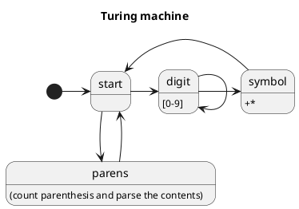

# Newmath parser

## Grammar

### List of symbols

- SCA (scalar) - the only terminal symbol.
- EXP (expression) 

### Definitions

|     |             |
|-----|-------------|
| SCA | `[0-9]+`    |
| EXP | `(EXP)`     |
| EXP | `EXP + EXP` |
| EXP | `EXP * EXP` |
| EXP | SCA         |

### Turing machine

I love Turing machines...

